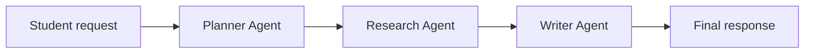

# Multi-Agent Student Task Coordinator

An A2A-inspired student assistant where specialized AI agents collaborate to complete academic requests.

## Overview

The application coordinates three agents:

1. **Planner Agent** breaks a request into practical steps.
2. **Research Agent** develops the information required by the plan.
3. **Writer Agent** converts the plan and research into a polished final response.

Agents exchange structured messages containing unique task IDs, sender and receiver names, instructions, timestamps, and completion statuses.

## Features

- Gemini API integration
- Planner, Research, and Writer agents
- Structured agent-to-agent task messages
- Task status tracking and communication logs
- Interactive Gradio interface
- Secure API-key entry with `getpass()`
- Error handling for empty requests and API failures
- Designed for future deployment on Google Cloud

## Architecture

## Technologies

- Python
- Gemini Interactions API
- Gradio
- Google Colab
- Pandas
- REST APIs

## Demonstration

### Application and Planner Agent

### Research Agent

### Writer Agent

### Agent Communication Log

## Run in Google Colab

1. Open `Multi_Agent_Student_Task_Coordinator.ipynb` in Google Colab.
2. Run the installation cell.
3. Enter a Gemini API key when prompted.
4. Run the remaining cells in order.
5. Open the Gradio link and submit an academic request.
6. Review the Planner, Research, Writer, and Communication Log tabs.

The API key is requested securely at runtime and is not stored in this repository.

## Example Request

> Create a four-week study plan for learning Python as a beginner.

The system creates a plan, develops relevant learning material, produces a complete curriculum, and records each agent transfer.

## Scope and Limitations

This is an educational, **A2A-inspired prototype** demonstrating agent specialization and structured inter-agent communication. It does not claim full compliance with the complete Google A2A specification. Agents currently execute sequentially, generated content should be reviewed by the user, and the Colab Gradio link is temporary.

## Future Improvements

- Deploy the application to Google Cloud Run
- Implement the official A2A SDK
- Add persistent task storage and authentication
- Support asynchronous and parallel agent execution
- Add automated response-quality evaluation

## Author

**Eric Rathod**  
Master of Artificial Intelligence – Design and Development  
Seneca Polytechnic
